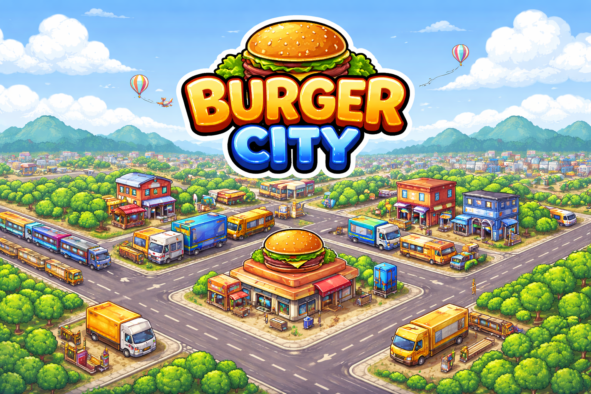
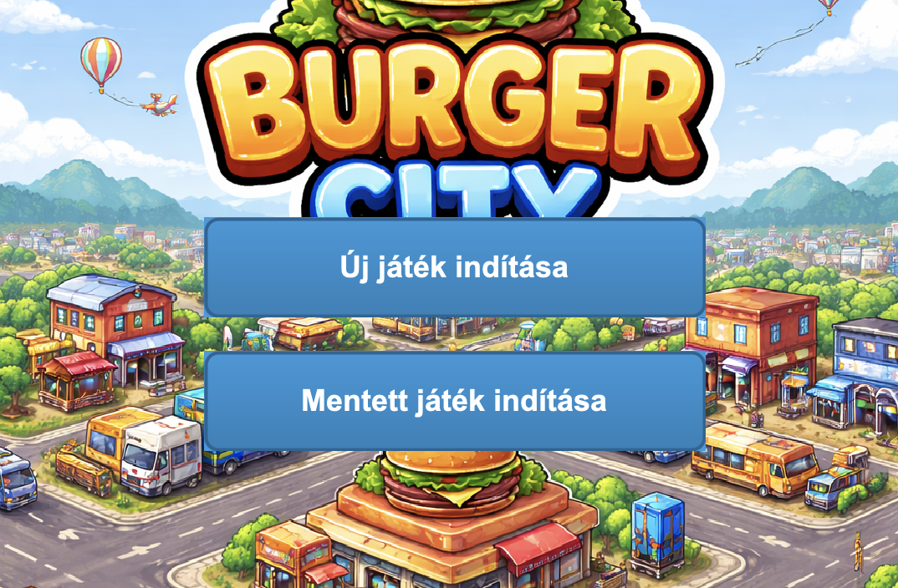
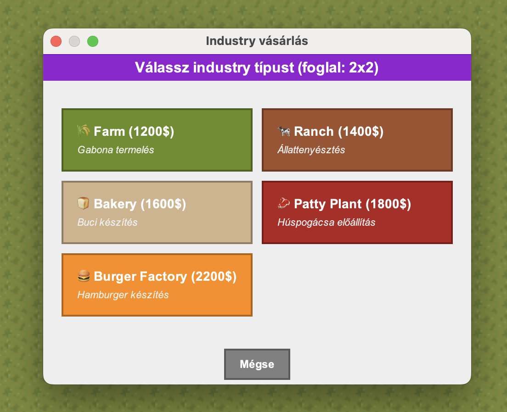
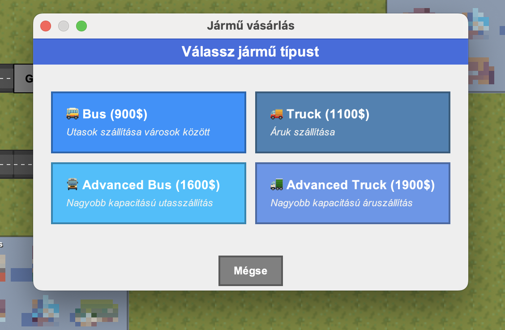
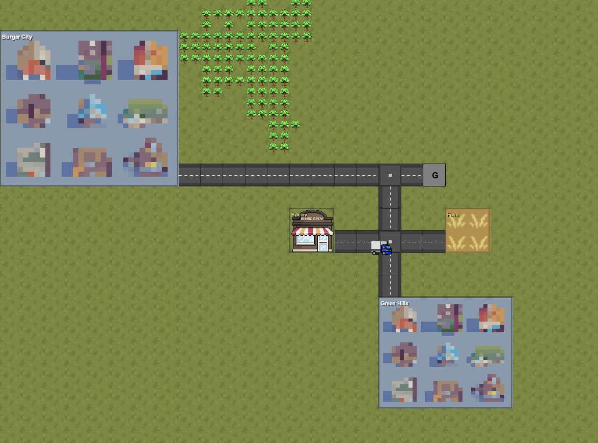

# Burger City

## A játék leírása

A játék lényege, hogy különböző gazdasági termelőépületeket építsünk, majd ezeket úthálózatokkal kössük össze. A játékos járműveket indíthat az utak között, amelyek az erőforrásokat egyik épületből a másikba szállítják a termelési folyamat során. A végső cél a hamburger előállítása, amelyet a városokba kell elszállítani a lehető legnagyobb profit érdekében. A játék középpontjában egy minél nagyobb, hatékonyabb és több pénzt termelő gazdasági rendszer kiépítése áll.

## Játék betöltése

Választhatunk már létező játék betöltése mellett, vagy új játékot is indíthatunk. Fontos, hogy mentsük a játékot!

A játékön belül a fenti gombokkal tudunk tevékenységeket választani.

## Építkezés

Építhetünk:
* Termelő épületeket
* Utakat
* Garázsokat
* Közlekedési lámpákat

## Jármű vásárlása

A járművásárlás opciót kiválasztva egy garázsra kattintunk. Ez után beállíthatjuk a játmű útvonalát, majd kiválaszthatjuk a típusát;
* Busz
* Kamion

## A játékmenet nyomonkövetése

A Dashboardról leolvasott információk alapján nyomon tudjuk követni a játék jelenlegi állapotát, és meg tudjuk hozni a szükséges döntéseket.

## Telepítés és futtatás

A projekt Java nyelven íródott, és Maven alapú felépítésű.

Előfeltételek:
- Java 21 vagy újabb
- Maven telepítve

Futtatás:
1. Lépj a projekt gyökérkönyvtárába.
2. Futtasd a következő parancsot a fordításhoz és a tesztek lefuttatásához:
   `mvn test`
3. A játék fő osztálya a `game.ui.GameUI`, amelyet a projektből indítva lehet elindítani.

## Projekt szerkezete

A forráskód főbb részei:
- `src/main/java/game/ui` – grafikus felület, dashboard, minimap, játéklogika UI része
- `src/main/java/game/map` – térkép, mezők, városok, iparágak
- `src/main/java/game/building` – épületek, utak, garázsok, közlekedési lámpák
- `src/main/java/game/vehicle` – járművek és útvonalak
- `src/test/java` – JUnit tesztek

## Játékmenet vezérlése

A játék során a következő alapvető műveletek használhatók:
- egér kattintás – építés, kiválasztás, információ megjelenítése
- egér húzás – térkép görgetése
- egérgörgő – nagyítás/kicsinyítés
- dashboard – pénzügyi és operatív információk megtekintése

## Fontos tudnivalók

- A játék mentése ajánlott, különösen új játék indítása előtt.
- A cél nem csak a gyors építkezés, hanem egy hatékony és nyereséges ellátási lánc kiépítése is.
- A játékos feladata a termelés, szállítás és profit optimalizálása a hamburger előállítása érdekében.

# Nézd meg a bemutató videót!

*Kattints a fenti képre a bemutató videó megtekintéséhez a YouTube-on!*